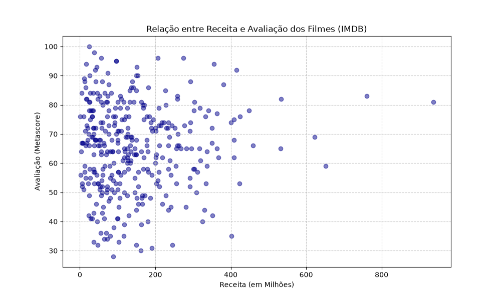

# Desafio Técnico - Looqbox Data Challenge

**Candidato:** Francisco Renan Leite da Costa  
**Data:** 25/06/2026  
**Contato:** renanleitedacosta@gmail.com

---

## 1. Teste SQL (SQL Test)

Abaixo estão as consultas SQL criadas para responder às perguntas com base no schema `looqbox-challenge`.

### Questão 1
> **Pergunta:** Quais são os 10 produtos mais caros da empresa?

#### Query SQL
```sql
WITH ranked_products_by_value AS (
	SELECT 
		*,
		RANK() OVER (ORDER BY PRODUCT_VAL DESC) AS rank_value
	FROM 
		`looqbox-challenge`.data_product 
)

SELECT
	*
FROM
	ranked_products_by_value
WHERE
	rank_value <= 10
```

#### Resultado
| PRODUCT_COD | PRODUCT_NAME | PRODUCT_VAL | DEP_NAME | DEP_COD | SECTION_NAME | SECTION_COD | rank_value |
|-------------|--------------|-------------|----------|---------|--------------|-------------|------------|
| 301409 | Whisky Escoces THE MACALLAN Ruby Garrafa 700ml com Caixa | 741.99 | BEBIDAS | 2 | BEBIDAS | 4 | 1 |
| 176185 | Whisky Escoces JOHNNIE WALKER Blue Label Garrafa 750ml | 735.90 | BEBIDAS | 2 | BEBIDAS | 4 | 2 |
| 315481 | Cafeteira Expresso 3 CORACOES Tres Modo Vermelho | 499.00 | BEBIDAS | 2 | BEBIDAS | 4 | 3 |
| 100280 | Vinho Portugues Tinto Vintage QUINTA DO CRASTO Garrafa 750ml | 445.90 | BEBIDAS | 2 | VINHOS | 30 | 4 |
| 320046 | Escova Dental Eletrica ORAL B D34 Professional Care 5000 110v | 399.90 | PERFUMARIA | 8 | HIGIENE BUCAL | 39 | 5 |
| 190817 | Champagne Rose VEUVE CLICQUOT PONSARDIM Garrafa 750ml | 366.90 | MERCEARIA | 6 | ARTIGOS-PARA-O-LAR | 2 | 6 |
| 153795 | Champagne Frances Brut Imperial MOET Rose Garrafa 750ml | 359.90 | MERCEARIA | 6 | ARTIGOS-PARA-O-LAR | 2 | 7 |
| 311397 | Conjunto de Panelas Allegra em Inox TRAMONTINA 5 Pecas Gratis Utensilios 5 Pecas | 359.00 | MERCEARIA | 6 | ARTIGOS-PARA-O-LAR | 2 | 8 |
| 147706 | Whisky Escoces CHIVAS REGAL 18 Anos Garrafa 750ml | 329.90 | BEBIDAS | 2 | BEBIDAS | 4 | 9 |
| 154431 | Champagne Frances Brut Imperial MOET & CHANDON Garrafa 750ml | 315.90 | MERCEARIA | 6 | ARTIGOS-PARA-O-LAR | 2 | 10 |
| 44311 | Champagne Frances Demi Sec Nectar Imperial MOET & CHANDON Garrafa 750ml | 315.90 | MERCEARIA | 6 | ARTIGOS-PARA-O-LAR | 2 | 10 |


---

### Questão 2
> **Pergunta:** Quais seções os departamentos de 'BEBIDAS' e 'PADARIA' possuem?

#### Query SQL
```sql
SELECT DISTINCT
	DEP_NAME, SECTION_NAME
FROM
	`looqbox-challenge`.data_product 
WHERE
	DEP_NAME IN ('BEBIDAS', 'PADARIA')
ORDER BY
	DEP_NAME
```

#### Resultado
| DEP_NAME | SECTION_NAME |
|--------------|-------|
| BEBIDAS | BEBIDAS |
| BEBIDAS | CERVEJAS |
| BEBIDAS | REFRESCOS |
| BEBIDAS | VINHOS |
| PADARIA | DOCES-E-SOBREMESAS |
| PADARIA | GESTANTE |
| PADARIA | PADARIA |
| PADARIA | QUEIJOS-E-FRIOS |


---

### Questão 3
> **Pergunta:** Qual foi o total de vendas de produtos (em $) de cada Área de Negócio no primeiro trimestre de 2019? 

#### Query SQL
```sql
SELECT 
	BUSINESS_NAME,
	SUM(SALES_VALUE) AS TOTAL_SALES
FROM 
	`looqbox-challenge`.data_store_cad AS store
JOIN
	`looqbox-challenge`.data_product_sales AS sales
    USING(STORE_CODE)
WHERE 
	sales.DATE >= '2019-01-01' AND
    sales.DATE < '2019-04-01'
GROUP BY
	BUSINESS_NAME
```
**Observação:** Não ficou claro pra mim se deveria multiplicar o valor por algo para ser em $, então mantive como estava.

#### Resultado
| BUSINESS_NAME | TOTAL_SALES |
|---------------------------------|---------------------|
| Varejo | 81032347.65 |
| Farma | 81776691.73 |
| Atacado | 80384884.60 |
| Posto | 32072326.40 |
| Proximidade | 80171122.80 |


---
---

## 2. Casos Práticos (Cases)

### Caso 1: Função Dinâmica de Recuperação de Dados
**Objetivo:** Criar uma função em Python (`retrieve_data`) flexível para gerar consultas e retornar um DataFrame com base em três parâmetros dinâmicos: `product_code`, `store_code` e `date`.

#### Solução em Python
```python
import os
from sqlalchemy import create_engine
from dotenv import load_dotenv
import pandas as pd


def retrieve_data(product_code: int, store_code: int, date: list[str]) -> pd.DataFrame:
    """
    Recupera os dados de vendas de produtos para um produto e uma loja específicos, em um período de tempo especificado.

    Args:
        product_code (int): Código do produto filtrado.
        store_code (int): Código da loja filtrada.
        date (list[str]): Lista contendo a data inicial e a data final.

    Returns:
        pd.DataFrame: Um DataFrame contendo as vendas dos produtos para o produto e a loja especificados, no período passado.
    """


    # Carrega as variáveis de ambiente
    load_dotenv()
    user = os.getenv("USER")
    password = os.getenv("PASSWORD")
    host = os.getenv("HOST")
    port = os.getenv("PORT")
    database = os.getenv("DATABASE")

    # Forma a string de conexão
    connection_string = f"mysql+pymysql://{user}:{password}@{host}:{port}/{database}"

    # Cria o motor de conexão
    engine = create_engine(connection_string)

    # Leitura dos arquivos SQL e aplicação das variáveis
    query_path = os.path.join(os.path.dirname(__file__), "queries", "get_product.sql")
    try:
        with open(query_path, "r", encoding="utf-8") as f:
            sql_template = f.read()

        sql_query = sql_template.format(
            product_code=product_code,
            store_code=store_code,
            start_date=date[0],
            end_date=date[1]
            )

    except Exception as e:
        print(f'Error: {e}')

    df = pd.read_sql(sql_query, con=engine)

    return df


def main():

    # Exemplo de execução da função
    df = retrieve_data(18, 1, ['2019-01-01', '2019-01-31'])
    print(df)

if __name__ == "__main__":
    main()
```

**Apoio de IA:** Solicitei a IA para apresentar o formato da string de conexão com um banco MySQL.

##### Arquivo `get_product.sql`
```sql
SELECT 
	* 
FROM 
	`looqbox-challenge`.data_product_sales
WHERE
	PRODUCT_CODE = {product_code} AND
    STORE_CODE = {store_code} AND
    (
    DATE >= '{start_date}' AND
    DATE <= '{end_date}'
    )
```

#### Retorno do Exemplo
```cli
   STORE_CODE  PRODUCT_CODE        DATE  SALES_VALUE  SALES_QTY
0           1            18  2019-01-01        708.5       65.0
1           1            18  2019-01-02       1297.1      119.0
2           1            18  2019-01-03       1144.5      105.0
3           1            18  2019-01-04       1090.0      100.0
4           1            18  2019-01-05        893.8       82.0
5           1            18  2019-01-06        741.2       68.0
6           1            18  2019-01-07        654.0       60.0
7           1            18  2019-01-08        741.2       68.0
8           1            18  2019-01-09       1373.4      126.0
9           1            18  2019-01-10       1068.2       98.0
10          1            18  2019-01-11       1057.3       97.0
11          1            18  2019-01-12        806.6       74.0
12          1            18  2019-01-13        686.7       63.0
13          1            18  2019-01-14        697.6       64.0
14          1            18  2019-01-15        763.0       70.0
15          1            18  2019-01-16       1199.0      110.0
16          1            18  2019-01-17       1068.2       98.0
17          1            18  2019-01-18       1057.3       97.0
18          1            18  2019-01-19        795.7       73.0
19          1            18  2019-01-20        697.6       64.0
20          1            18  2019-01-21        675.8       62.0
21          1            18  2019-01-22        806.6       74.0
22          1            18  2019-01-23       1395.2      128.0
23          1            18  2019-01-24       1035.5       95.0
24          1            18  2019-01-25       1057.3       97.0
25          1            18  2019-01-26        850.2       78.0
26          1            18  2019-01-27        763.0       70.0
27          1            18  2019-01-28        708.5       65.0
28          1            18  2019-01-29        730.3       67.0
29          1            18  2019-01-30       1384.3      127.0
30          1            18  2019-01-31       1177.2      108.0
```

---

### Caso 2: Visualização de Ticket Médio por Loja
**Objetivo:** Calcular o Ticket Médio (TM) por Loja e por Categoria de Negócio no período entre `2019-10-01` e `2019-12-31`.

#### Solução em Python
```python
import os
from sqlalchemy import create_engine
from dotenv import load_dotenv
import pandas as pd

def get_sql_data() -> pd.DataFrame:
    # Carrega as variáveis de ambiente
    load_dotenv()
    user = os.getenv("USER")
    password = os.getenv("PASSWORD")
    host = os.getenv("HOST")
    port = os.getenv("PORT")
    database = os.getenv("DATABASE")

    # Forma a string de conexão
    connection_string = f"mysql+pymysql://{user}:{password}@{host}:{port}/{database}"

    # Cria o motor de conexão
    engine = create_engine(connection_string)

    # Carrega os caminhos dos arquivos SQL
    store_cad_path = os.path.join(os.path.dirname(__file__), "queries", "data_store_cad.sql")
    store_sales_path = os.path.join(os.path.dirname(__file__), "queries", "data_store_sales.sql")

    # Lê as queries de dentro dos arquivos SQL
    with open(store_cad_path, "r", encoding="utf-8") as f:
        store_cad_query = f.read()
    with open(store_sales_path, "r", encoding="utf-8") as f:
        store_sales_query = f.read()
    
    # Carrega os dados
    store_cad = pd.read_sql(store_cad_query, con=engine)
    store_sales = pd.read_sql(store_sales_query, con=engine, parse_dates=['DATE'])

    return store_cad, store_sales

def main():

    # Exemplo de execução da função
    store_cad, store_sales = get_sql_data()
    
    # Filtrando para o período especificado
    store_sales = store_sales[(store_sales['DATE'] >= '2019-10-01') & (store_sales['DATE'] <= '2019-12-31')]

    # Junção dos DataFrames a partir do STORE_CODE
    df_merged = store_cad.merge(store_sales, on='STORE_CODE', how='inner')

    # Agrupando a soma de venda e quantidade pela loja e categoria
    df_grouped = df_merged.groupby([
        'STORE_NAME',
        'BUSINESS_NAME'
    ]).agg({
        'SALES_VALUE': ['sum'],
        'SALES_QTY': ['sum']
    }).reset_index()

    # Cálculo do Ticket Médio
    df_grouped['TM'] = (df_grouped['SALES_VALUE'] / df_grouped['SALES_QTY']).round(2)

    # Mantendo e renomeando apenas as colunas necessárias
    df_result = df_grouped[['STORE_NAME', 'BUSINESS_NAME', 'TM']].rename(
		columns={
			'STORE_NAME': 'Loja',
			'BUSINESS_NAME': 'Categoria'
		}
	)

    print(df_result)

if __name__ == "__main__":
    main()
```

#### Tabela de Resultados Gerada
```cli
              Loja    Categoria     TM

0            Bahia      Atacado  15.39
1          Bangkok        Posto  13.67
2            Belem  Proximidade  15.37
3           Berlin  Proximidade  15.39
4     Buenos Aires      Atacado  15.39
5          Chicago       Varejo  15.53
6            Dubai      Atacado  15.39
7        Hong Kong        Farma  26.35
8           London        Farma  28.99
9            Madri        Farma  29.03
10           Miami        Posto  13.67
11        New York  Proximidade  15.39
12           Paris  Proximidade  15.39
13  Rio de Janeiro        Farma  29.59
14            Roma       Varejo  15.39
15        Salvador      Atacado  15.39
16       Sao Paulo       Varejo  15.39
17          Sidney        Posto  13.67
18           Tokio       Varejo  15.39
19       Vancouver        Posto  13.67
```
---

### Caso 3: Visualização com Base no IMDB
**Objetivo:** Criar um gráfico explicativo a partir da tabela `IMDB_movies` e justificar a escolha da visualização.

#### Gráfico Gerado


#### Justificativa da Visualização

A escolha do gráfico de Scatter Plot teve como objetivo analisar a ocorrência e correlação entre as variáveis correspondentes à receita e à avaliação dos críticos (Metascore).

Com o objetivo de realizar uma análise rebusta e com uma boa confiabilidade dos dados, filtrei a base para os registros em que:

- A receita não é nula (`NULL`).
- O volume de votos do filme é superior à média geral.

Essa filtragem permite analisar apenas os filmes com os dados de receita válidos e com nível de popularidade expressivo.

A partir da correlação entre essas variáveis é possível observar uma sutil tendência de alta (filmes com avaliação superior tendem a ter maior receita). No entanto, não se trata de uma correlação linear forte que garanta alta bilheteria em caso de uma boa nota.

#### Script de Geração do Gráfico (Python)
```python
import os
from sqlalchemy import create_engine
from dotenv import load_dotenv
import pandas as pd
import matplotlib.pyplot as plt

def get_imdb_data():
    # Carrega as variáveis de ambiente
    load_dotenv()
    user = os.getenv("USER")
    password = os.getenv("PASSWORD")
    host = os.getenv("HOST")
    port = os.getenv("PORT")
    database = os.getenv("DATABASE")

    # Forma a string de conexão
    connection_string = f"mysql+pymysql://{user}:{password}@{host}:{port}/{database}"

    # Cria o motor de conexão
    engine = create_engine(connection_string)

    # Carrega os caminhos dos arquivos SQL
    imdb_path = os.path.join(os.path.dirname(__file__), "queries", "IMDB_movies.sql")

    # Lê as queries de dentro dos arquivos SQL
    with open(imdb_path, "r", encoding="utf-8") as f:
        imdb_query = f.read()
    
    # Carrega os dados
    imdb = pd.read_sql(imdb_query, con=engine)

    return imdb

def main():
    df = get_imdb_data()
    
    plt.figure(figsize=(10, 6))
    plt.scatter(df['RevenueMillions'], df['Metascore'], alpha=0.5, color='darkblue')
    
    plt.title('Relação entre Receita e Avaliação dos Filmes (IMDB)')
    plt.xlabel('Receita (em Milhões)')
    plt.ylabel('Avaliação (Metascore)')
    plt.grid(True, linestyle='--', alpha=0.7)
    
    # Exibe o gráfico interativo na tela
    plt.show()
    
if __name__ == "__main__":
    main()
```

##### Arquivo `IMDB_movies.sql`
```sql
SELECT
    *
FROM
    `looqbox-challenge`.IMDB_movies
WHERE
	RevenueMillions IS NOT NULL AND
    Votes > (
		SELECT
			AVG(Votes)
		FROM
			`looqbox-challenge`.IMDB_movies
    )
```

---
